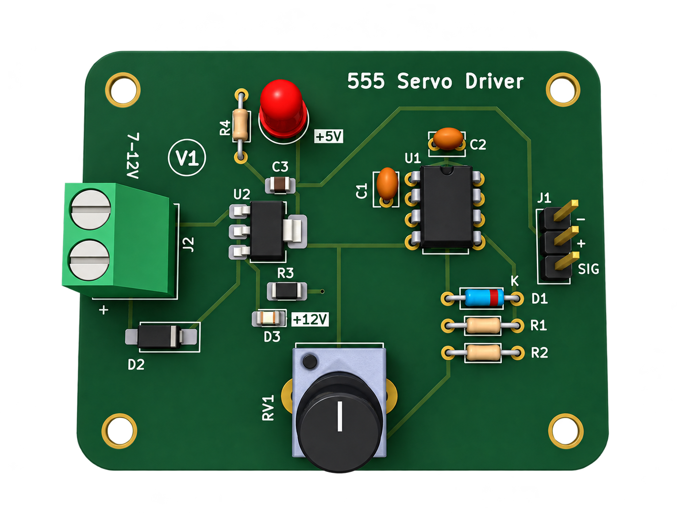

# Hi, I'm Shlok Chorge

### Electronics & Embedded Systems | C/C++ | PCB Design

Exploring embedded systems through hands-on electronics, programming, microcontrollers, and PCB design.

---

## About Me

>**I'm a third-year Electronics & Telecommunication Engineering student building my skills across embedded systems, microcontrollers, PCB design, and low-level programming.**

- Strong foundation in **C and C++**
- Hands-on experience with **Arduino and ESP32**
- Experience with **low-frequency PCB design using KiCad**
- Familiar with **Data Structures & Algorithms**
- Comfortable with **Git and GitHub**
- Interested in developing skills across both **embedded hardware and software**

---

## Technical Skills

**Programming**  
C · C++ · Python (fundamentals) · Java (fundamentals)

**Core Concepts**  
Data Structures & Algorithms · Object-Oriented Programming (fundamentals)

**Embedded & Hardware**  
Arduino Uno · Arduino Nano · ESP32 · Microcontrollers · PCB Design

**Tools**  
Git · GitHub · KiCad · VS Code · Arduino IDE

---

## Projects

### PCB Design

 555 Servo Controller

  

A custom PCB designed using KiCad around an NE555-based servo control circuit.

**Focus:** PCB Design · Electronics · KiCad

[View Repository →](https://github.com/shlok-ac/Servo-Controller-555)

---

---

## Currently Learning

- Embedded Systems
- Microcontrollers
- VLSI
- Embedded development using Keil
- Practical PCB design and hardware development

---

## Certifications

- **Data Structures & Algorithms**

---

## Connect

- GitHub: https://github.com/shlok-ac
- Email: shlokchorge.a@gmail.com
